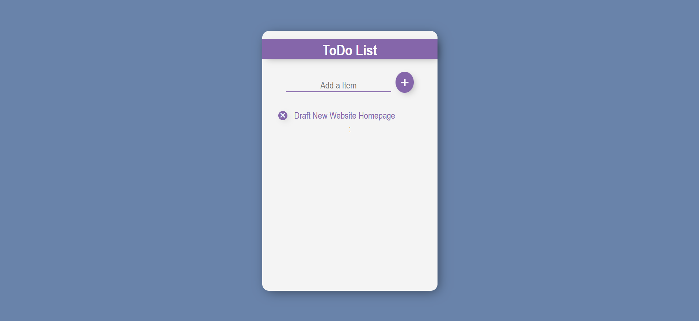

# To Do List

A todo list application built on ReactJS using react hooks, props and other different components.



## Requirements:

* React Version: **18.2.0**
* Node Version: **18.14.1**
* NPM Version: **9.5.0**

## Instructions:

1. Get the source code on your pc via git.

```js
  git clone https://github.com/muskanmi/Todo-List-React
```

2.  Navigate inside the folder through your terminal.

```js
  cd Todo-List-React
```

3. Now, install the required dependencies by running the following command:

```js
  npm install
```

4. Finally, start the application by running:

```js
  npm start
```

5. Voila! the application is ready for use. You can access it at [http://localhost:3000](http://localhost:3000).

